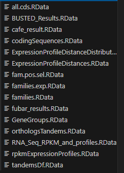

# Dokumentation

## Metadata

- R, Rstudio etc. , Version 
- Projektinformationen

## Reproduction of original results [1], Vorgehensweise, Ordnerstruktur

- 4 Sections unterteilt
- 

### required Packages

- auflisten

### RData Files aus Server runtergeladen, Objecte geladen 

### `1. Load tissue specific expression data`

#### 1.1 Description

#### 1.2 Input/Output

- executables

exec/loadRpkmRnaSeqCounts.R <-- RPKM_counts_table.tsv (`id / tissue / expression) (Input)
exec/loadRpkmRnaSeqCounts.R --> RNA_Seq_RPKM_and_profiles.RData (Output) (contains: rna.seq.exp.profils + `rpkm.rna.seq.counts`)
                            --> save rna.seq.exp.profils as RNA_Seq_RPKM_and_profiles.tsv

exec/loadCodingSequences.R <-- Input: aet.fa aly.fa ath.fa bra.fa chi.fa cru.fa esa.fa tpa.fa  (DNA-Fasta-Files, for 8 Brassicaceaen genomes)
all.cds -> list containing (aet.cds, aly.cds, ath.cds, bra.cds, chi.cds, cru.cds, esa.cds, tpa.cds)
exec/loadCodingSequences.R --> codingSequences.RData (Output) (aet.cds, aly.cds, ath.cds, bra.cds, chi.cds, cru.cds, esa.cds, tpa.cds, all.cds)

#### 1.3 Datentypen, Datenstruktur

- kurze Erläuterung, head()

### `2. Compute pairwise gene expression profile distances within gene groups`

#### 2.1 Description

#### 2.2 Input/Output

exec/computeExpressionProfileDistances.R <-- tandems.lst, orthologs.lst, families.lst, expressionProfilesDists (Input)

- Objects/Variables generated: 

- `families.exp.prof.dists` & `families.exp.prof.dists.tissue`
- `orthologs.exp.prof.dists` & `orthologs.exp.prof.dists.tissue`
- `tandems.exp.prof.dists` & `tandems.exp.prof.dists.tissue`

exec/computeExpressionProfileDistances.R --> `ExpressionProfileDistances.RData` (Output) (contains the above Objects/variables)

# -----------------------------------------------------------------------------------------
- fehlende Inputs: tandems.lst (list), orthologs.lst (list), families.lst (list), expressionProfilesDists
# -----------------------------------------------------------------------------------------

# -----------------------------------------------------------------------------------------

exec/LoadOrthologsAndTandems.R <-- eight_brassicaceae_tandems.txt, eight_brassicaceae_orthologs.txt

- Objects/Variables generated: orthologs & tandems

exec/LoadOrthologsAndTandems.R --> orthologsTandems.RData (contains the above Objects/variables)

# -----------------------------------------------------------------------------------------

exec/defineGeneSets.R <-- orthologs & tandems

- Objects/Variables generated: orthologs.lst & tandems.lst

exec/defineGeneSets.R --> GeneGroups.RData (contains the above Objects/variables)

# -----------------------------------------------------------------------------------------

exec/loadGeneFamilies.R <-- mcl_output.txt, mcl_table.tsv (from markov clustering tool mcl)

- Objects/Variables generated: families.lst & (families.genes.df, families.df) (nicht essentiel)

exec/loadGeneFamilies.R --> families.RData (contains the above Objects/variables)

# -----------------------------------------------------------------------------------------

R-functions/expression_funks.R <-- gene.accessions (??), rna.seq.exp.profils (aus Section-1)

- Objects/Variables generated: expressionProfilesDists 

R-functions/expression_funks.R --> expressionProfilesDists

# -----------------------------------------------------------------------------------------

#### 2.3 Datentypen, Datenstruktur

### `3. Expression Profile based Function Diversity`

#### 3.1 Description

#### 3.2 Input/Output

#### 3.3 Datentypen, Datenstruktur

### `4. Expression vector space analysis`

Kommentare: Beschreiben Sie Funktionen und wichtige Codeabschnitte.

Roxygen2: Verwenden Sie Roxygen2 für eine formale Funktionsdokumentation.

